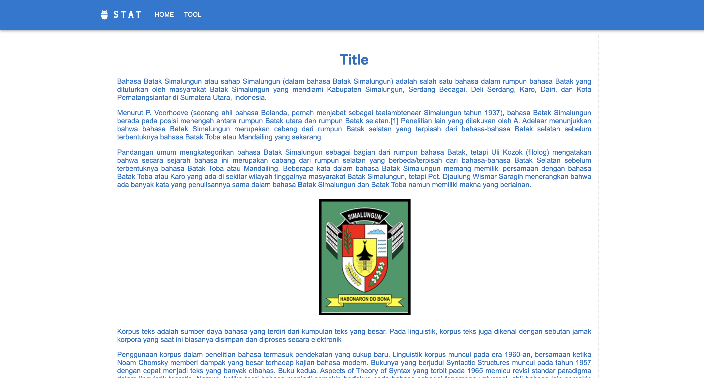
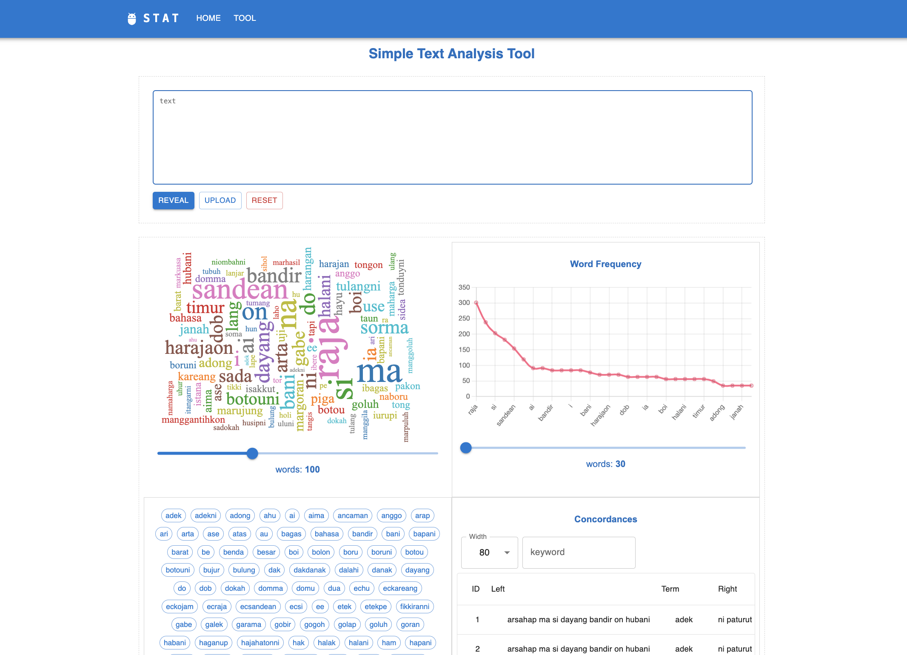

# simple-text-analysis-tool

### pull code from git remote repository
```commandline
> git init
> git remote add origin https://github.com/michaelwp/simple-text-analysis-tool.git
> git pull origin main
```

### setup backend (http://localhost:5000)
```commandline
> python -m venv ./venv
> source venv/bin/activate 
> pip install -r requirements.txt
> python -m flask --app app run
```

### setup Client (http://localhost:3000)
```commandline
> cd client
> npm i --force 
> npm start
```

### setup MySQL v.8.3.0 Database
```commandline
> mysql -uroot -p
> CREATE DATABASE stat;
> GRANT ALL PRIVILEGES ON stat.* TO 'root'@'localhost';
```





### create env file
- create file with name `.env`
- add these env items as follows (example for local configuration)
, replace `DB_PASS` with your own database's password 
, and `SECRET_KEY` with your own secret key :
```text
PORT=5000
SECRET_KEY=rahasia

DB_USER=root
DB_PASS=password
DB_HOST=localhost
DB_NAME=stat

APPLICATION_COOKIE_DOMAIN=localhost
```

